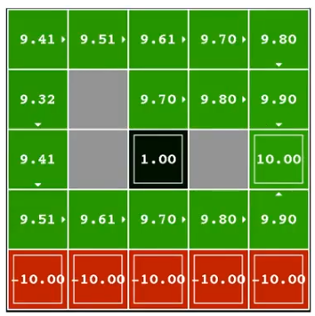

# The Foundations of Deep RL in 6 Lectures
This lecture is given by [Pieter Abbeel](https://en.wikipedia.org/wiki/Pieter_Abbeel)

# L1 MDPs, Exact Solution Methods, Max-ent RL

---- ---- ---- ----
## Lecture Series
  * Lecture 1: MDPs Foundations and Exact Solution Methods
  * Lecture 2: Deep Q-Learning
  * Lecture 3: Policy Gradients, Advantage Estimation
  * Lecture 4: TRPO, PPO
  * Lecture 5: DDPG, SAC
  * Lecture 6: Model-based RL

---- ---- ---- ----
## Outline for This Lecture
  * Motication
  * Markov Decision Processes
  * Exact Solution Methods
    *  Value Iteration
    *  Policy Iteration
  * Maximum Entropy Formulation

---- ---- ---- ----
## A Few Deep RL Highlights
  * Atari (DQN) [Deepmind] - 2013
    * Video games, including Pong, Enduro, Beamrider, Q*bert
  * 2D locomotion (TRPO) [Berkley]
  * AlphaGo [Deepmind]
    * Tian et al, 2016
    * Maddison et al, 2014
    * Clark et al, 2015
  * 3D locamotion (TRPO+GAE) [Berkley]
    * [Shulman, Moitz, Levine, Jordan, Abbeel, ICLR 2016]
  * Real Robot Manipulation (GPS) [Berkley]
    * [Levine*, Finn*, Darrell, Abbeel, JMLR 2016]
  * Dota2 (PPO) [OpenAI]
    * OpenAI Dota Bot beat best humans 1:1 (Aug 2018)
  * DeepMimic [Berkley]
  * AlphaStar [Deepmind] 2019
  * Rubik's Cube (PPO+DR) [OpenAI]

---- ---- ---- ----
## Markov Decision Process
  * Agent -> Environment (action $a_t$)
  * Environment -> Agent (state $s_t$)
  * Environment -> Agent (reward $r_t$)
 
This is an iterative process, in next iteration will have $t_{t+1}$, $r_{t+1}$. 

Assumption: agent gets to observe the state

[Drawing from Sutton and Barto, Reinforcement Learning: An Introduction, 1998]

---- ---- ---- ----
## Markov Decision Process (MDP)
  * An MDP is (formally) defined by:
      * Set of states $S$
      * Set of actions $A$
      * Transition function $P(s'|s,a)$
          * The probability $P$ of 
          * $s'$ next state
          * given current state $s$ and 
          * took action $a$
      * Reward function $R(s, a, s')$
      * Start state $s_0$
      * Discount factor $\gamma$
          * used for discounting the future reward
      * Horizon $H$
          * how long we gonna act

---- ---- ---- ----
## Examples
$MDP(S,A,T,R,\gamma,H)$,

**goal**: $max_{\pi}E[\sum_{t=0}^H \gamma^t R(S_t,A_t,S_{t+1})|\pi]$

The goal for the reinforcement algorithm is to maximize $max_\pi(...)$  the expected $E(...)$ discounted reward $\gamma^tR(...)$ over time $t=[0 .. H]$

* Cleaning robot
* Walking robot
* Pole balancing
* Games: tetris, backgammon
* Server management
* Shortest path problems
* Model for animals, people

What you need to do is to map your problem onto the MDP, and you can run your algorithm

---- ---- ---- ----
## Example MDP: Gridworld
Simple environment

* Start
* Agent - robot
* Rock
* Reward (+1)
* Fire (-1)

**goal**: $max_{\pi}E[\sum_{t=0}^H \gamma^t R(S_t,A_t,S_{t+1})|\pi]$

---- ---- ---- ----
## Optimal Value Function V*
*Value intuition which will be foundations of many models we talk later*

$V^*(s)= max_{\pi}E[\sum_{t=0}^H\gamma^tR(s_t,a_t,s_{t+1})|\pi,s_0=s]$

= sum of discounted rewards when starting from state s and acting optimally

Best possible policy $max_{\pi}$

Let's assume:

actions deterministically successful, $\gamma=0.9$, $H=100$

$V^*(4,3)=1$

$V^*(3,3)=0.9$

$V^*(2,3)=0.9*0.9=0.81$

$V^*(1,1)=0.9*0.9*0.9*0.9*0.9=0.59$

$V^*(4,2)=-1$

actions successful w/probablity 0.8, $\gamma=0.9$, $H=100$

$V^*(4,3)=1$

$V^*(3,3)=0.8 * 0.9 * V^*(4,3)+0.1*0.9*V^*(3,3) + 0.1*0.9*V^*(3,2)$

$V^*(2,3)=$

$V^*(1,1)=$

$V^*(4,2)=$

---- ---- ---- ----
## Value Iteration
* $V^*_0(s)$ = optimal value for state $s$ when $H=0$
    * $V^*_0(s)=0$   $\forall s$
        * we can initialize the value for all states as 0
* $V^*_1(s)$ = optimal value for state $s$ when $H=1$
    * $V^*_{1}(s)=max_{a}\sum_{s'}P(s'|s,a)(R(s,a,s')+\gamma V^*_0(s'))$
        * We look at all actions available in that state $P(s'|s,a)$
        * Then sum over all future states the probability for future as $s'$
        * given the current $s$, took action $a$
        * multiply with the reward we get from that transition $R(s,a,s')$
        * plus a discount factor $\gamma V^*_0(s')$
        * the value get on forth and on forth from the zero point
    * this is really the key idea behind value iteration, is that:
        * you decompose the promises thing a certain number of times into the immediate thing
* $V^*_2(s)$ = optimal value for state $s$ when $H=2$
    * $V^*_{2}(s)=max_{a}\sum_{s'}P(s'|s,a)(R(s,a,s')+\gamma V^*_1(s'))$
* $V^*_k(s)$ = optimal value for state $s$ when $H=k$
    * $V^*_{k}(s)=max_{a}\sum_{s'}P(s'|s,a)(R(s,a,s')+\gamma V^*_{k-1}(s'))$

---- ---- ---- ----
## Value Iteration

* Algorithm
    * Start with $V^*_0(s)=0$ for all $s$.
    * For k=1, ..., H:
        * For all states s in S:
        * $V^*_{k}(s) \leftarrow max_{a}\sum_{s'}P(s'|s,a)(R(s,a,s')+\gamma V^*_{k-1}(s'))$
        * $\pi^*_k(s) \leftarrow argmax_{a}\sum_{s'}P(s'|s,a)(R(s,a,s')+\gamma V^*_{k-1}(s'))$
            * This is called a **value update** or **Bellman update/back-up**

$V^*_{k}(s)=max_{a}\sum_{s'}P(s'|s,a)(R(s,a,s')+\gamma V^*_{k-1}(s'))$

* As it is shown to you, if we run infinitve Horizon value, we will get the above. It converges to that or very close to that much sooner.
* The speed of convergence is often related to the discount factor $\gamma$. The close the discount is to 0, the faster the things converges. The close the discount is to 1, the longer it might take, for things to converge
---- ---- ---- ----
## Value Iteration Convergence

**Theorem.** Value iteration converges. At convergence, we have found the optimal value function $V^*$ for the discounted infinite horizon problem, which satisified the Bellman equations

$\forall S \in S$ : $V^*_{k}(s)=max_{A}\sum_{s'}P(s'|s,a)(R(s,a,s')+\gamma V^*_{k-1}(s'))$

* Now we know how to act for infinite horizon with discounted rewards!
    * Run value iteration till convergence.
    * This produces $V^*$, which in turn tells us how to act, namely following:
    * $\pi^*(s) = argmax_{a\in A}\sum_{s'}T(s,a,s')[R(s,a,s')+\gamma V^*(s')*]$
    * and this produces $V^*$, and then, once we have $V^*$, we will be able to extract actual optimal action using the Bellman equation, yet one more time, or we might have just stored the optimal action for our Bellman updates during running the algorithm.
* Notes: the infinite horizon optimal policy is stationary, i.e., the optimal action at a state $s$ is the same action at all times. (Efficient to store!)
---- ---- ---- ----
## Convergence: Intuition

Why do we know this is going to converge

* $V^*(s)$ = expected sum of rewards accumulated starting from state $s$, acting optimally for $\infty$ steps
* $V^*_H(s)$ = expected sum of rewards accumulated starting from state $s$, acting optimally for $H$ steps
* Additional reward collected over time steps $H+1$, $H+2$, ...
    * $\gamma^{H+1}R(s_{H+1})+\gamma^{H+2}R(s_{H+2})+...\le \gamma^{H+1}R_{max}+\gamma^{H+2}R_{max}+...$
    * $= \frac{\gamma^{H+1}}{1-\gamma} R_{max}$
    * goes to zero as $H$ goes to infinity
    * Hence $V^*_H \overset{H\rightarrow\infty}\rightarrow V^*$

For simplicity of notation in the above it was assumed that rewards are always greater than or equal to zero. If rewards can be negative, a similar argument holds, using $max|R|$ and bounding from both sides. 

---- ---- ---- ----
## Convergence and Contractions

* Definition: max-norm: $||U||= max_s|U(s)|$
* Definition: An update operation is a $\gamma$-contraction in max-norm if and only if for all $U_{i}$, $V^*_{i}$ :
    * $||U_{i+1}-V_{i+1}||\le\gamma||U_i-V_i||$
* Theorem: A contraction converges to a unique fixed point, no matter initialization.
* Fact: the value iteration update is a $\gamma$-contraction in max-norm
* Corollary: value iteration converges to a unique fixed point
* Additional fact: $||V_{i+1}-V_{i+1}||<\epsilon$, $\Rightarrow$ $||V_{i+1}-V^*||<2\epsilon\gamma/(1-\gamma)$
    * i.e. once the update is small, it must also be close to converged

---- ---- ---- ----
## Exercise 1: Effect of Discount and Noise

* Start conditions
    * (a) Prefer the close exit(+1), risking the cliff(-10)
    * (b) Prefer the close exit(+1), but avoid the cliff(-10)
    * (c) Prefer the distant exit(+10), risking the cliff(-10)
    * (d) Prefer thee distant exit(+10), avoiding the cliff(-10)
* Parameters
    * (1) $\gamma=0.1$, noise=0.5
    * (2) $\gamma=0.99$, noise=0
    * (3) $\gamma=0.99$, noise=0.5
    * (4) $\gamma=0.1$, noise=0

Note: once you get the reward, the game is over. So you can just get any of 1 or 10 reward. The exercise is to figure out for (a) from (1) .. (4), which is the optimal

---- ---- ---- ----
## Exercise 1 Solution

* (a) Prefer the close exit(+1), risking the cliff(-10)
* (4) $\gamma=0.1$, noise=0
    * noise = 0, means dont take any risk
    * There's 0.0 chance of your action being unsuccessful
    * If the noise is >0.0, which means in some circumstance(random()>1-noise), the action will be randomed
    * In this way, you can safely navigate to the distant exit
    * And we shall make sure to discount enough to ensure the agent goes to the distant exit
    * The grey block is cliff, the red block is fire

* (b) Prefer the close exit(+1), but avoid the cliff(-10)
* (1) $\gamma=0.1$, noise=0.5

* (c) Prefer the distant exit(+10), risking the cliff(-10)
* (2) $\gamma=0.99$, noise=0

* (d) Prefer thee distant exit(+10), avoiding the cliff(-10)
* (3) $\gamma=0.99$, noise=0.5

---- ---- ---- ----
## Q-Values

$Q^*(s,a)$ = expected utility starting in $s$, taking action $a$, and (thereafter) acting optimally

Bellman Equation:

$Q^*(s,a)=\sum_{s'}P(s'|s,a)(R(s,a,s')+\gamma \max_{a'}Q^*(s', a'))$

Q-Value Iteration:

$Q^*_{k+1}(s,a)=\sum_{s'}P(s'|s,a)(R(s,a,s')+\gamma \max_{a'}Q^*_k(s', a'))$

resume at 45:30
---- ---- ---- ----
[Simple Reinforcement Learning: Q-learning](https://towardsdatascience.com/simple-reinforcement-learning-q-learning-fcddc4b6fe56)

## What’s ‘Q’?
The ‘q’ in q-learning stands for quality. Quality in this case represents how useful a given action is in gaining some future reward.

